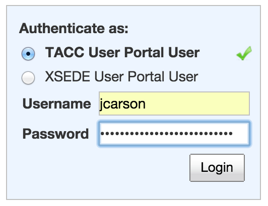
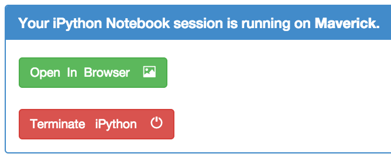

iPython Notebooks at TACC
=========================

---
#### Objectives
*	Use the TACC Visualization Portal to launch an iPython notebook
*	Open an example notebook
*	Explore code execution and plotting

---

## TACC Visualization Portal

[https://vis.tacc.utexas.edu/](https://vis.tacc.utexas.edu/)

Logging in:




  
* After clicking ```Login```, wait a moment for authentification
* The page will automatically display the "Jobs" tab
* Select Maverick
* Select a project that has an allocation on Maverick
* Select iPython Notebook
* Click "Set iPython Password" and follow the instructions
* Once your iPython password is set, the "Jobs" screen may reset.  If so, reselect the options as shown below.
  
---  
  

---

Starting a job will take a few moments, depending on the load on the system.  Please wait patiently.  If the startup window is off the bottom edge of your screen, you can move it up with the mouse to make sure it did not fail.  Once your job starts, you will see a message like this:

---  


---

Now open iPython Notebook in your browser by clicking the green button.

Congratulations!
  
  
## Using Notebooks

An iPython notebook can contain code, comments, and plots, among other things.  Many researchers use them as they perform analysis to keep an informal record of what they have done.  All of the content of a notebook resides in a ```.ipynb``` file, except for any data you load from a file of course.

As a brief example adapted from [http://nbviewer.ipython.org/gist/fonnesbeck/5850463](http://nbviewer.ipython.org/gist/fonnesbeck/5850463), try entering the following:

```
print "Hello World"
```
Note that to execute code you should press Shift+Enter

```
import numpy as np
import matplotlib.pyplot as plt
```

```
%matplotlib inline
```
Note that the ```%``` at the start of the line signals that this is a command for the notebook,
rather than a statement in Python.

```
plt.plot(np.random.normal(size=100), np.random.normal(size=100), 'ro')
```

As you execute commands, the computation is happening on the iPython server running on your own private node on Maverick with 20 CPU cores and 256GB of memory!  The result is sent to the client, which is running in the browser window.


## Challenges

*	Add a cell between some of your commands, and put in some markdown text describing what your code does
*	What happens if you change previous code blocks?
*	What happens if you "Restart the Kernel"?  When might you want to restart the Kernel?