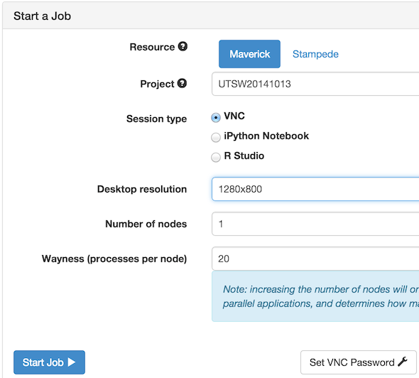

Matlab at TACC
=========================

---
#### Objectives
*	Setup the license file
*	Use the TACC Visualization Portal to launch an interactive Matlab session
*	Create a simple script and run it in "batch mode"

---

## TACC Visualization Portal

[https://vis.tacc.utexas.edu/](https://vis.tacc.utexas.edu/)

Logging in:


  
* After clicking ```Login```, wait a moment for authentification
* The page will automatically display the "Jobs" tab
* Select Maverick
* Select a project that has an allocation on Maverick
* Select VNC
* Click "Set VNC Password" if you have not done this before and follow the instructions
* Once your VNC password is set, the "Jobs" screen may refresh. If so, reselect the options as before.
  
---  
  

---

Starting a job will take a few moments, depending on the load on the system.  Please wait patiently.  If the startup window is off the bottom edge of your screen, you can move it up with the mouse to make sure it did not fail.  Once your job starts, you will be taken to a browser-based VNC session.  You can go back to the "Jobs" tab to manage the job, open the VNC desktop in a new window, or open the session with a native VNC client instead of the browser.

Now we are all set to run Matlab interactively, but users need a working license to proceed.


## Setting the License File

Matlab usage on TACC systems follows a "Bring-Your-Own-License" format.  TACC is allowed to host the Matlab software for use by any TACC users, but users must maintain their own licenses. This is usually in the form of a Matlab license server with a floating network license. Furthermore the license server must be accessible from the compute nodes on TACC systems. You can test this with:
```telnet hostname port_number```

The TACC helpdesk staff can provide ip-ranges to your license admin to add exceptions in your firewall rules for license checkout.  Note that "node locked" licenses will not work at TACC, since you are likely to have a different compute node each session.

If you have this license information for the class, try running the examples.  If not, please pair up with someone who does for this class. TACC will help however it can afterwards to work with your institution so that Matlab at TACC is available for you.

We will take a few minutes now to help people get setup.
  
## Using the Matlab GUI 

In the VNC session, we first need to load the Matlab module in the terminal window, and then we can simply run the Matlab executable.

```
$ module load matlab
$ matlab
```

This will bring up the Matlab GUI if the license file is setup.  If not, Matlab will prompt you to provide license information.

Once the GUI is loaded, try running commands. As you execute commands, the computation is happening on your own private node on Maverick with 20 CPU cores and 256GB of memory!

## Running Matlab in Batch Mode

To test batch mode, first close the Matlab GUI.

In the terminal window, try the following command:

```
$ matlab -r "b = 5; h = 3; a = 0.5*(b.*h);"
```

There are a number of ways to invoke Matlab.  The exact method you use may depend on how your M files are structured and your personal preference.  The Mathworks forum is a good place to get more information, such as this post: [http://www.mathworks.com/matlabcentral/answers/41558-how-to-run-matlab-files-in-batch-mode-or-as-a-batch-process-guide-request](http://www.mathworks.com/matlabcentral/answers/41558-how-to-run-matlab-files-in-batch-mode-or-as-a-batch-process-guide-request)

## Challenges
* Try saving commands to an M file and running the M file in batch mode
