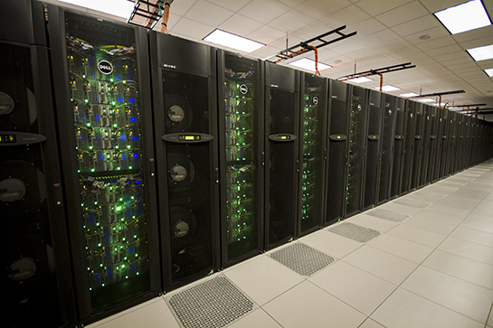
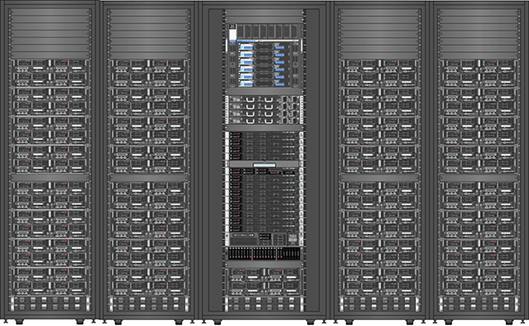
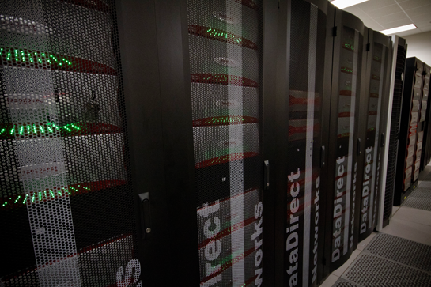
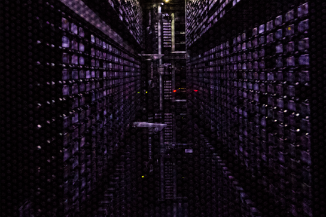

Computing at the Texas Advanced Computing Center
================================================
---
TACC is a research center at the University of Texas at Austin with roughly 120 staff and researchers. TACC constructs and manages high performance computing systems and software for thousands of resaerchers worldwide through funding from the National Science Foundation, the University of Texas System, and numerous other private and public support sources.  TACC also develops tools and cyberinfrastructure through research projects and collaborations.

TACC offers advanced computing and data storage resources free of charge to academic researchers.  Through the University of Texas Research Cyberinfrastructure project, investigators and their collaborators have priority access to some of the worlds most powerful computing systems.

## Advanced Computing Systems
### Lonestar
  
Lonestar is a powerful, multi-use cyberinfrastructure HPC and remote visualization resource. The system contains 22,656 cores within 1,888 Dell compute nodes.  Each compute node has 24GB of memory and 12 CPU cores.

### Stampede
  
Stampede is one of the largest computing systems in the world for open science research. Supported by the National Science Foundation Grant ACI-1134872, this system provides unprecedented computational capabilities to the national research community enabling breakthrough science that has never before been possible.

### Maverick
  
Maverick combines capacities for interactive advanced visualization and large-scale data analytics as well as traditional high performance computing. Maverick provides NVIDIA K40 GPUs for remote visualization and GPU computing to the national community.

## Data Services
### Corral
  
 Corral consists of 6 Petabytes of online disk and a number of servers providing high-performance storage for all types of digital data. It supports MySQL and Postgres databases, high-performance parallel file system, and web-based access, and other network protocols for storage and retrieval of data to and from sophisticated instruments, HPC simulations, and visualization laboratories.
 
### Ranch
  
TACC's long-term mass storage solution is an Oracle® StorageTek Modular Library System, named Ranch. Ranch utilizes Oracle's Sun Storage Archive Manager Filesystem (SAM-FS) for migrating files to/from a tape archival system with a current offline storage capacity of 60 PB. 

## Using TACC Resources

To use TACC systems, three things are required:  
1. an **Account** (i.e. username and password) - Every TACC user should have their own account.  Sharing credentials is not allowed.  
2. a **Project** - "Principle investigators" can create projects in the [TACC Portal](http://portal.tacc.utexas.edu) describing the research for which they need resources.  
3. an active **Allocation** - an "allocation" is a quota of computing time or storage space devoted to a project.  A project can have allocations on several different systems to serve their research goals.  Allocations are usually active for a year, and principle investigators or their delegates can renew allocations each year for more computing resources.  

Once you have all three of those things, you should be able to login to a compute system (whichever ones your Allocation gives you access to) through SSH.  Mac users will likely use their "Terminal" to do this, while Windows users can use "Git Bash" or another third party application.  You should use the same username and password that you use in the Portal.

## Challenges

*	Login to the portal and check what projects you are involved in (there should at least be this training project)
*	What allocations does that project have?
*	SSH into Lonestar and look over the "welcome" text
